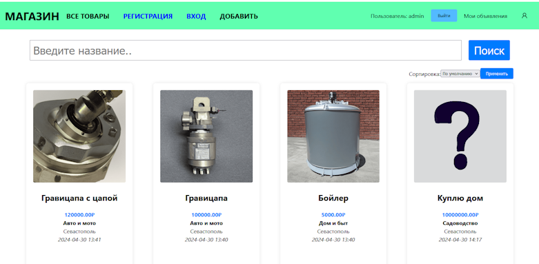

## SolarLab Academy - Simple store API. Пример Ui:

# Функционал:
- Регистрация пользователя
- Вход пользователя, выдача JWT токена
- Создание объявления с указанием автора
- Выдача списка всех объявлений с пагинацией и сортировкой
- Поиск по имени во всех объявлениях
- Демонстрация всех объявлений конкретного пользователя
- Работа с объявлением: добавление, изменение, удаление
- Капча при регистрации

# Стек:
- .NET 8
- PostgreSQL 16
- Angular 17
- Redis 7

# Тестирование:
- 29 Unit тестов
- 2 API теста
